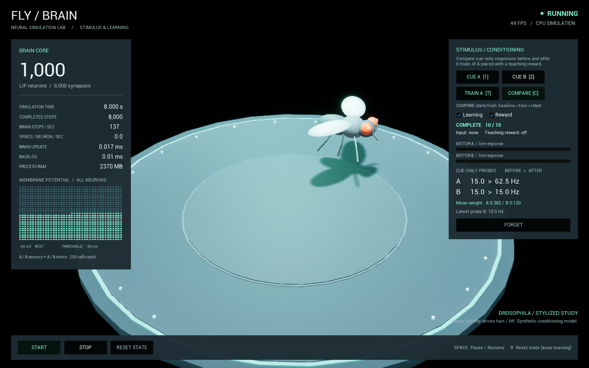

# Fly Brain Simulator — UE 5.8 CPU Brain Core

1,000 LIF neurons / fixed 1 ms timestep / C++20. The original baseline has 16,000 synapses; the conditioning demo uses an 8,000-edge sensory-to-motor circuit.
Neuron state is stored in contiguous C++ arrays, with a CSR graph. No neuron Actors or UObjects.

## Interactive fly demo

Open the project in UE 5.8, open `/Game/Demo/FlyBrainDemo` (the new startup map), and press **Play**. Use a reasonably large viewport, or **New Editor Window (PIE)**. The editor viewport before Play is empty: the game mode creates the scene at runtime.

- **START** / **Space**: run/resume the brain and the fly animation.
- **STOP** / **Space**: freeze simulation time and the fly pose.
- **RESET STATE** / **R**: cancel the trial, stop and reset the pose/neuron state, while retaining learned weights.
- Click the game viewport once if keyboard shortcuts do not have focus.

The dashboard shows simulation time, steps, actual steps per wall-clock second, spikes per neuron per wall-clock second, brain update cost, backlog, process RAM and FPS. The 1,000-cell display reads actual membrane potentials. Each 250-cell population is homogeneous and may fire synchronously. The numeric performance dashboard refreshes at 4 Hz.

The stylized fly has a body, red eyes, six articulated legs, antennae and two wings, all in one Actor. Its orbit, bobbing and slowed wingbeat follow **simulation time**; measured motor activity additionally controls its turning, lift and wingbeat amplitude. The synthetic circuit and pose mapping are not a biological connectome or physics-based flight model. The mesh never writes neuron state. The stage uses engine primitive meshes and a shared project material. Lumen, ray tracing and path tracing are disabled; FXAA and non-Nanite fallback meshes are enabled.

## 刺激と学習の確認

1. Play後に **COMPARE [C]** を押すと、重みを初期化して「A/Bの学習前測定 → A＋報酬を6回 → A/Bの学習後測定」を自動実行します（6秒のシミュレーション時間）。
2. 右パネルで発火率 **BEFORE > AFTER** と平均シナプス重みを比較します。通常は **A: 15 → 62.5 Hz、B: 15 → 15 Hz** になります。
3. **Learning** をOFFにしてCOMPAREを再実行すると、Aも変化しません。**Reward** をOFFにした対照実験でも学習しません。COMPAREは毎回初期化するため、前回の学習は持ち越しません。
4. 手動では **CUE A [1] / CUE B [2]** で400 msの刺激、**TRAIN A [T]** でA＋報酬を6回与えます。刺激ボタンも自動的にStartします。学習後にCUE Aを押して反応を確認できます。
5. **STOP / Space** は試行を一時停止し、STARTで続行します。**RESET STATE / R** は試行と測定表示を消して停止しますが、学習した重みは保持します。**FORGET** は重みも消去します。学習は現在のPlayセッション内のみで、終了後は保存されません。

比較用の測定では、毎回膜電位・入力・トレースを同じ初期状態に戻し、**報酬なし・重み更新なし**で同一刺激を与えます。運動ニューロン250個の400 ms中の発火数からHzを計算します。Bは未学習の対照です。ライブの反応バーは約50 msで平滑化した運動発火率（100 Hzで満杯）で、ハエの反応もこの実測値から作ります。学習中の報酬による強い反応だけを「学習済み」と扱うことはありません。

比較実行中は刺激の重複や条件変更を防ぐため操作を制限します。設定変更時には古い比較結果を消します。変更したい場合はRESET STATEで試行を終了してください。

The original `/Game/Maps/SimulationMap` and its Blueprints remain available. The new map overrides its GameMode with `FlyBrainDemoGameMode`; no manual Blueprint wiring is needed. For asset regeneration on a fresh checkout, see [Scripts/create_demo_assets.py](Scripts/create_demo_assets.py). Existing demo assets are not overwritten by that script. Python is needed only for regeneration, not for playing the demo.

Development console commands: `DemoStart`, `DemoStop`, `DemoReset`, `DemoCueA`, `DemoCueB`, `DemoTrain`, `DemoCompare`, `DemoForget`, `DemoCapture [delay seconds]`. Capture defaults to five seconds; use `DemoCapture 8` to capture a completed comparison. It saves to the runtime Saved directory's `Screenshots/FlyDemo.png` (the standalone editor game can redirect Saved to the user's UnrealEngine folder).



## Blueprint

1. Build `FlyBrainSimulatorEditor` (Development / Win64), then open the project.
2. In a Level Blueprint or Widget with a game-world context, use **Get World Subsystem** and select **BrainSimulationSubsystem**.
3. Call **Start**, **Stop**, or **Reset** on the returned subsystem.

The subsystem starts stopped. Start resumes; Stop freezes state and backlog; Reset stops and restores the initial state while keeping the topology. Each PIE/game world has its own brain. Editor preview worlds do not run the simulation.

Blueprint getters expose neuron/synapse count, step count, simulation time, backlog, and core storage bytes. C++ consumers can inspect read-only voltage/spike spans through `GetCore()`. Spikes represent the most recently completed step. Do not retain spans across reinitialization or access the core from another thread.

Learning actions are also BlueprintCallable: `EnableConditioningDemo`, `StimulateA/B`, `TrainA`, `RunComparison`, `ForgetLearning`, `SetLearningEnabled`, `SetRewardEnabled`. Outside the demo, the subsystem starts with the original baseline; EnableConditioningDemo switches to the experimental circuit.

## Validation

From an x64 Visual Studio Developer Command Prompt, in the repository root:

```bat
cmake -S Tests/BrainCore -B Tests/BrainCore/Intermediate -G "NMake Makefiles" -DCMAKE_BUILD_TYPE=Release
cmake --build Tests/BrainCore/Intermediate
ctest --test-dir Tests/BrainCore/Intermediate -V
```

UE Automation tests: `FlyBrain.Subsystem.Lifecycle`, `FlyBrain.Demo.Motion`, and `FlyBrain.Learning.Controls` (Session Frontend / Automation). Standalone CTest additionally exercises conditioning, learning/reward-off controls, memory reset, and replay across frame partitions.

See [architecture](docs/ARCHITECTURE.md) and [validation record](docs/VALIDATION.md).
